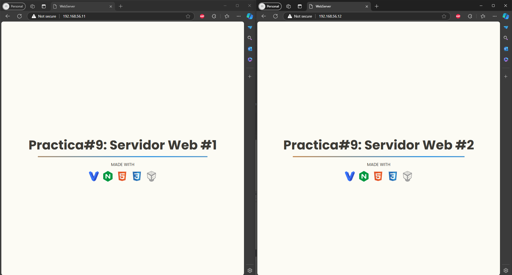

# About

Servidores Web corriendo en `Apache` dentro de una maquina virtual `Virtual Box`, configurado con `Vagrant` y balanceando las peticiones a los servidores son un loadbalancer corriendo en `Ngninx`.

### Real-Time Aplication

